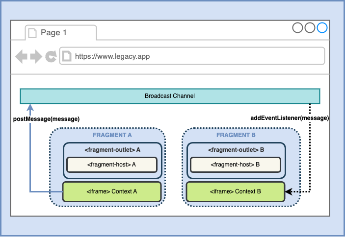

_Last updated_: December 8, 2024

Because Web Fragments are encapsulated in a `custom element` `shadowRoot`, they are part of the same [Document Object Model](https://developer.mozilla.org/en-US/docs/Glossary/DOM) and can leverage [Web Platform APIs](https://developer.mozilla.org/en-US/docs/Web/API). This makes Web Fragments future-proof and agnostic, and reduces maintenance efforts.

> Our team is currently working with standards bodies to push parts of the Web Fragments to the Web Platform as standards.

## Using `Broadcast Channel` to communicate between fragments

Fragments can share data using the [Broadcast Channel API](https://developer.mozilla.org/en-US/docs/Web/API/Broadcast_Channel_API) to post messages and share state.

### Broadcasting scenario example

Assume a catalog or product list as a first fragment and a shopping cart as a second fragment. When items are added to the cart using a button in the product list, the cart gets a message from the catalog.

```javascript
// fragment A - post (broadcast) message
const bc = new BroadcastChannel("/cart");
bc.postMessage({ type: "cart_cleared" });
bc.close();
```

```javascript
// fragment B - listen and process message
const handleMessage = (event: MessageEvent) => {
  const { type, product } = event.data;
  if (type === 'add_to_cart') {
    addItem(product);
  }
};

const bc = new BroadcastChannel("/cart");
bc.addEventListener('message', handleMessage);

return () => {
  bc.removeEventListener('message', handleMessage);
};
```



Please note that all [fragments](./glossary#fragment) should share the same origin.

---

#### Authors

<ul class="authors">
    <li class="author"><a href="https://github.com/anfibiacreativa">anfibiacreativa</a></li>
    <li class="author"><a href="https://github.com/igorminar">IgorMinar</a></li>
</ul>
